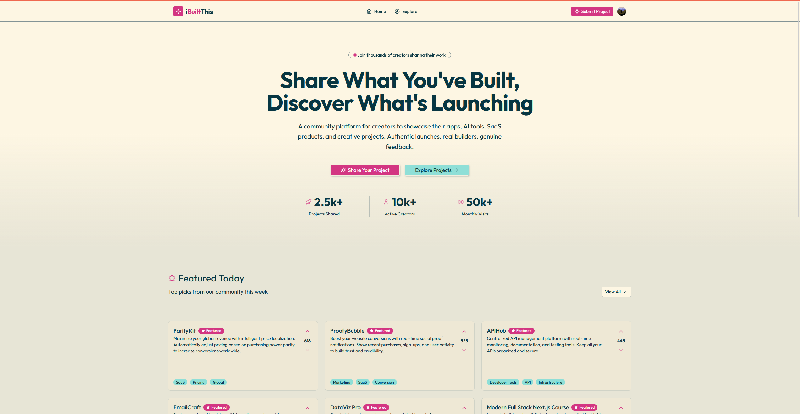
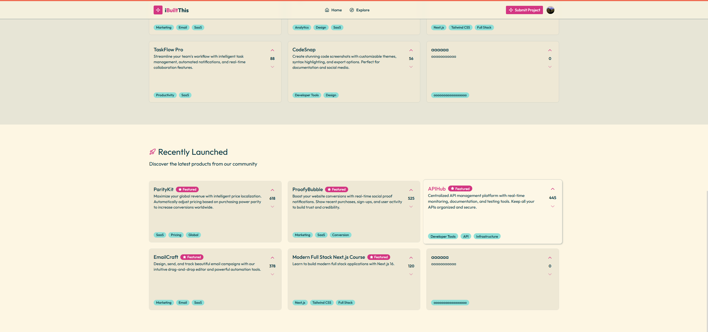
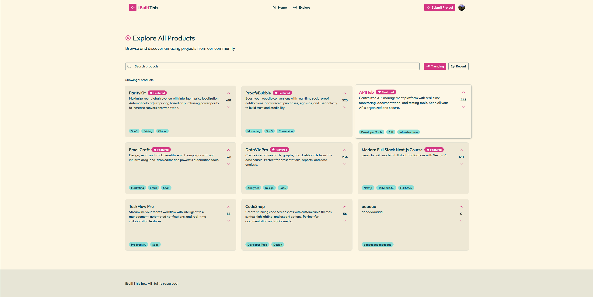
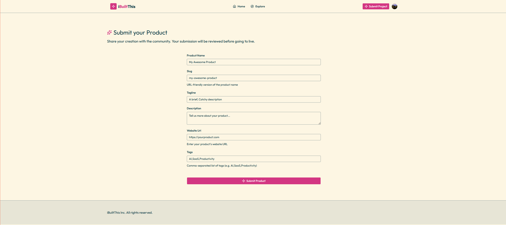
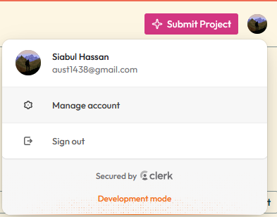
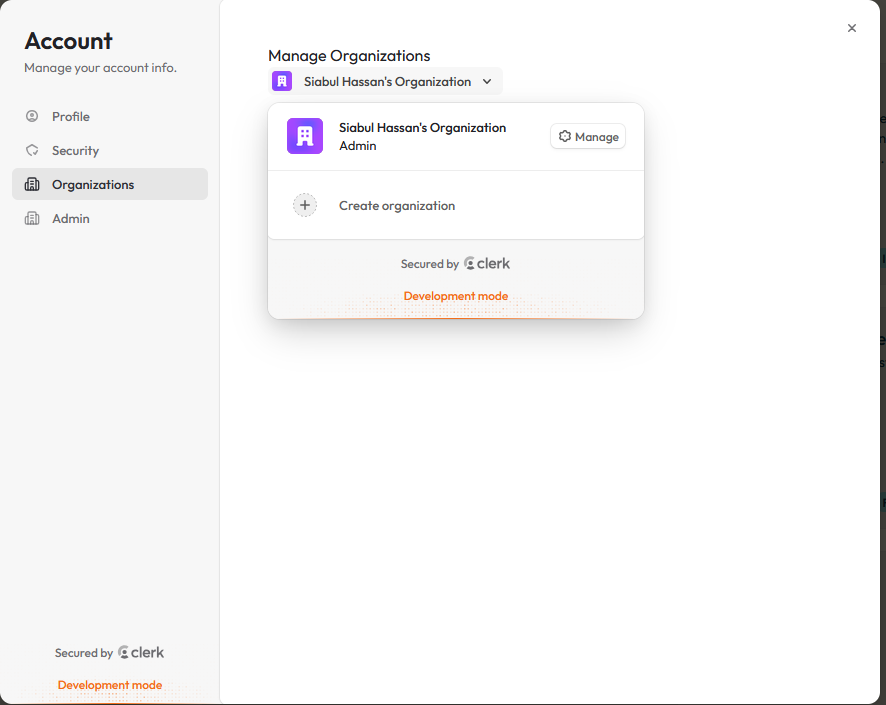
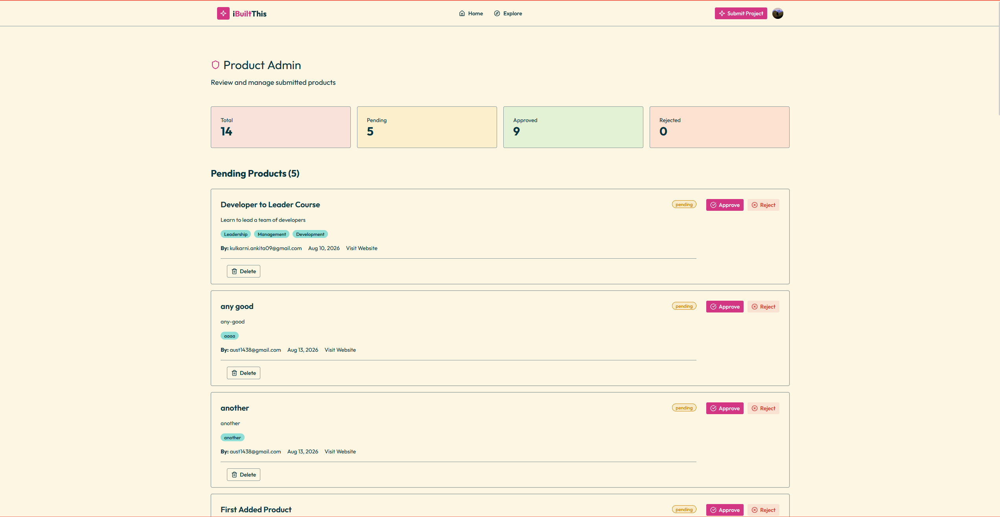

# iBuiltThis

**Share what you have built. Discover what is launching.**

iBuiltThis is a full-stack community platform where creators can publish apps, AI tools, SaaS products, and other digital projects. Visitors can discover launches, search and sort products, view detailed product pages, and support projects through voting. Signed-in creators can submit their work for review, while administrators manage the approval workflow from a protected dashboard.



## Features

- Product discovery through featured and recently launched sections
- Search by product name and sort by trending or recent launches
- Dedicated product pages with descriptions, tags, creator information, launch dates, external links, and voting
- Optimistic voting feedback powered by React transitions and Server Actions
- Creator authentication, account management, and organizations through Clerk
- Validated product submissions with field-level feedback using Zod
- Moderation workflow with pending, approved, and rejected product states
- Protected admin dashboard with status totals and approve/reject actions
- Neon Postgres persistence with Drizzle ORM
- Next.js Cache Components and Partial Prerendering for fast navigation with streamed dynamic content

## Screenshots

### Discover featured and recent launches

The home page introduces the community, highlights featured projects, and streams recently launched products.



### Explore the catalog

Approved products can be searched by name and sorted by popularity or launch date.



### Submit a product

Signed-in creators can provide a product name, slug, tagline, description, website, and tags. Submissions enter the moderation queue as pending.



### Authentication and organizations

Clerk provides sign-in, account management, and organization membership. Organization context is attached to product submissions.

<table>
  <tr>
    <td width="42%"></td>
    <td width="58%"></td>
  </tr>
  <tr>
    <td align="center">Account menu</td>
    <td align="center">Organization management</td>
  </tr>
</table>

### Moderate submissions

Administrators can review product details, monitor status totals, and approve or reject pending submissions.



## Tech stack

| Area | Technology |
| --- | --- |
| Framework | Next.js 16 App Router and React 19 |
| Language | TypeScript |
| Styling | Tailwind CSS 4, shadcn components, Base UI, and Lucide icons |
| Authentication | Clerk users and organizations |
| Database | Neon serverless Postgres |
| Data layer | Drizzle ORM and Drizzle Kit |
| Validation | Zod 4 |
| Runtime and package manager | Bun |

## How it works

1. Public visitors browse approved products on the home, explore, and product detail pages.
2. Clerk authenticates creators and supplies the active user and organization context.
3. A creator submits a validated product through a Server Action. New products are stored with a `pending` status.
4. Users whose Clerk public metadata contains `isAdmin: true` can access `/admin`.
5. Admin approval publishes a product by changing its status to `approved`; rejection changes it to `rejected`.
6. Neon stores product content, status, ownership, organization, timestamps, and vote totals.

## Getting started

### Prerequisites

- [Bun](https://bun.sh/) 1.3 or newer
- A [Neon](https://neon.com/) Postgres database
- A [Clerk](https://clerk.com/) application with organizations enabled

### 1. Install dependencies

```bash
bun install
```

### 2. Configure environment variables

Create `.env.local` in the project root:

```env
DATABASE_URL=your_neon_pooled_connection_string
NEXT_PUBLIC_CLERK_PUBLISHABLE_KEY=your_clerk_publishable_key
CLERK_SECRET_KEY=your_clerk_secret_key
```

The application uses `DATABASE_URL` at runtime and for Drizzle commands. Keep `.env.local` private and never commit real credentials.

### 3. Apply the database schema

```bash
bunx drizzle-kit push
```

The schema creates the `products` table and indexes for unique slugs, moderation status, and Clerk organization IDs.

### 4. Optionally load demo products

```bash
bunx tsx db/seed.ts
```

> [!WARNING]
> The seed script deletes every existing product before inserting the demo records. Only run it against a disposable development database.

### 5. Start the development server

```bash
bun run dev
```

Open [http://localhost:3000](http://localhost:3000).

## Admin access

The `/admin` route checks the signed-in Clerk user's public metadata. To grant admin access, set the following metadata on the user in the Clerk Dashboard:

```json
{
  "isAdmin": true
}
```

Users without this value are redirected to the home page. The application also expects an active Clerk organization when a creator submits a product or votes.

## Available commands

| Command | Purpose |
| --- | --- |
| `bun run dev` | Start the Turbopack development server |
| `bun run build` | Create a production build and run type checking |
| `bun run start` | Serve the production build |
| `bun run lint` | Run ESLint |
| `bunx drizzle-kit push` | Push the Drizzle schema to Postgres |
| `bunx tsx db/seed.ts` | Reset and seed the products table with demo data |

## Project structure

```text
app/
  admin/                 Protected moderation dashboard
  explore/               Searchable and sortable product catalog
  products/[slug]/       Streamed product detail pages
  submit/                Creator submission page
components/
  admin/                 Moderation cards, actions, and statistics
  common/                Header, footer, section headers, and empty states
  landing-page/          Hero, featured, recent, and statistics sections
  products/              Product cards, explorer, form, voting, and skeletons
  ui/                    Shared UI primitives
db/
  schema.ts              Drizzle product schema and indexes
  seed.ts                Development seed script
lib/
  admin/                 Admin Server Actions
  products/              Product queries, mutations, and validation
proxy.ts                 Clerk middleware and organization provisioning
```

## Production

Create and serve an optimized build with:

```bash
bun run build
bun run start
```

The production environment must provide the same Neon and Clerk variables used during development. The current build uses the Node.js runtime required by Next.js Cache Components.
